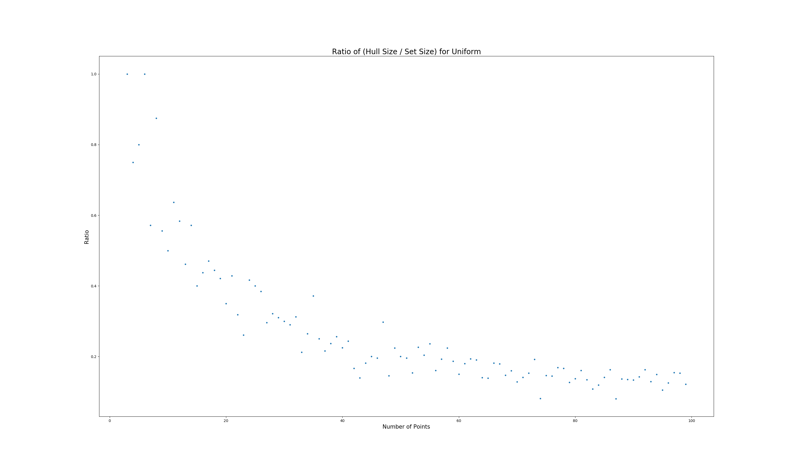
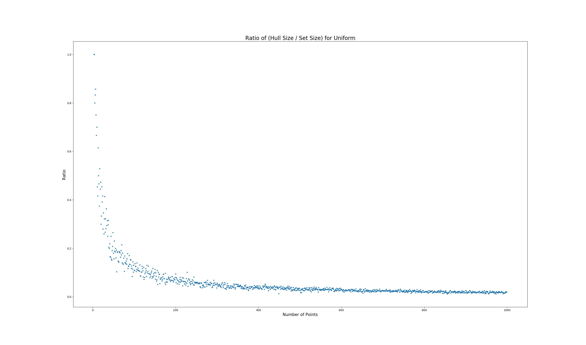
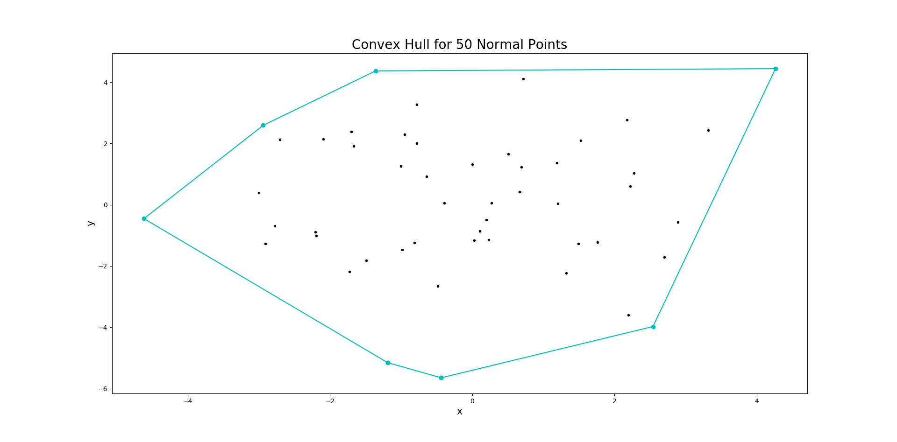
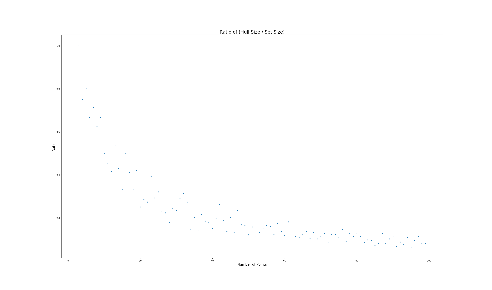
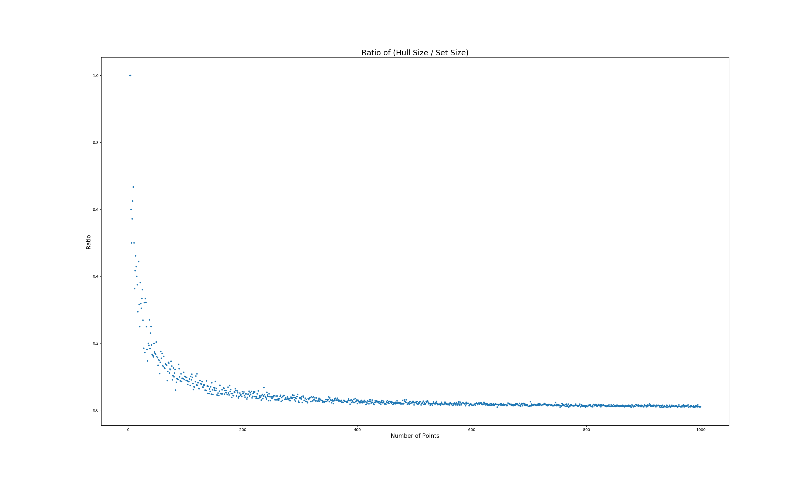
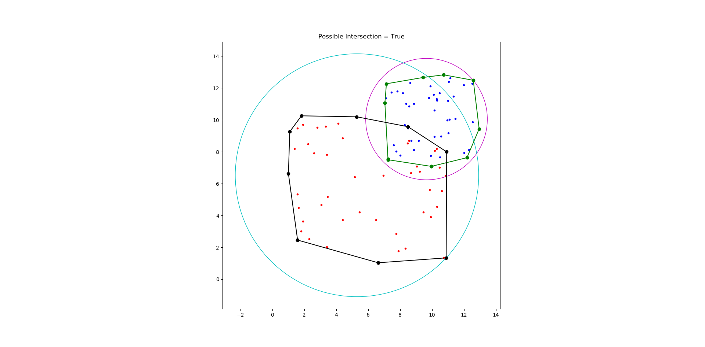

# CMPE 365 Lab 3
## Max Gillham - 10183941 - 14mfg2@queensu.ca

### Question 1 - Ratio Hull Size to Set Size for Uniform Distribution
Using the Graham Scan Algorithm and a set of n points, uniformly distributed about the origin I investigated the computed convex hull and its properties.  
Consider a set of 50 corrdinates (x,y) where x and y are ranged from [-5,5] distributed uniformly.  


Now, consider repeating this process for various set sizes.
```
for i in range(3,n):
    size of set = i
    ratio = hull size / set size
```
Below is a plot of the computed ratio for set sizes 3 to 100.



Here, the average ratio is ~0.27.  Now, increasing the set size from 3 to 1000.

  

Where the average ratio computed over this interval is ~0.06.

### Question 2 - Ratio Hull Size to Set Size for Normal Distribution  
Similar to the previous question, we repeat the experiment of hull ratios, however, this time the x and y cordinates are generated by a normal distribution.  
First consider a set of 50 cordinates (x,y) where x and y are ranged from (-5,5) distributed normally.



Now we iterate, similar to before, for the sample set size from 3 to 100.  



Where the average ratio computed is ~0.22.  Repeat, but this time for set sizes 3 to 1000.



Where the average ratio computed over this interval is ~0.04.  

The average ratio for the points deviate more when the number of samples is smaller. For small n, the ratio generated from uniform points is larger. However, as the size of the sample set gets larger the ratios both approach 0.


### Question 3 - Do the Hulls NOT Intersect
Checking if the hulls intersect is challenging, however one can determine if two do not intersect by checking if their respective circles about the convex hull intersect.  Given two sets of points, I compute the convex hulls, smallest circle such that it contains the points and determine if the hulls have a possibility of intersecting.
For example, given a set of 50 points centered at (10,0) with Uniform(-3,3) distribution, and a set of 50 points centered at (0,0) with Uniform(-5,5) distribution, this method renders the following correct output.


Here, this method can determine that the two convex hulls do not intersect.   However, it can only detect if there is a possibility of intersection.  As you can see, this method returns true for the following sets of points, however only one of the examples actually has overlapping convex hulls.

  

  

