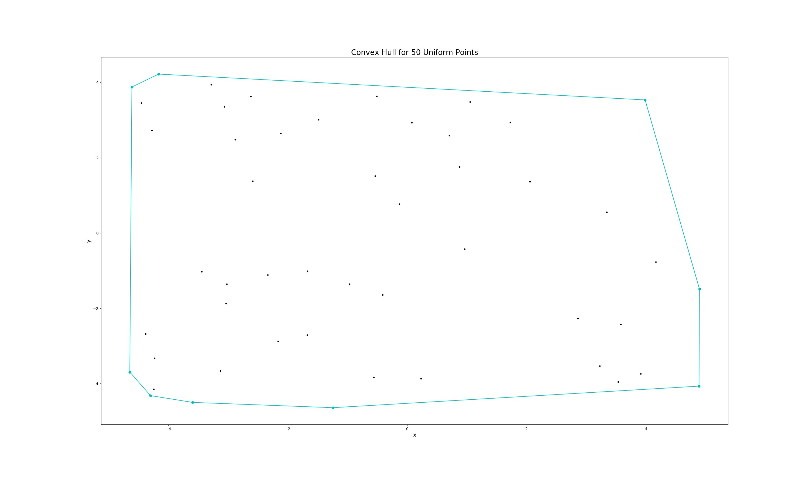
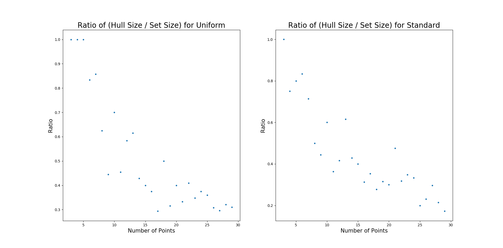
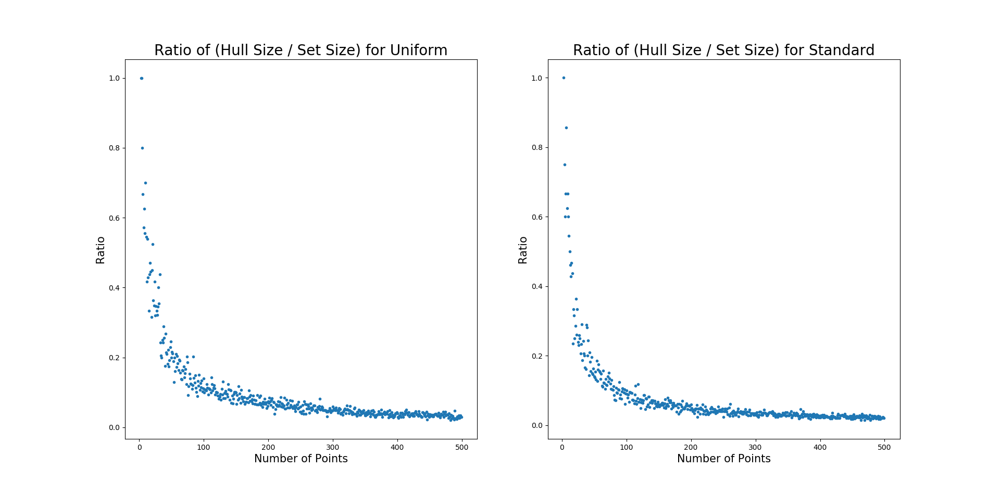
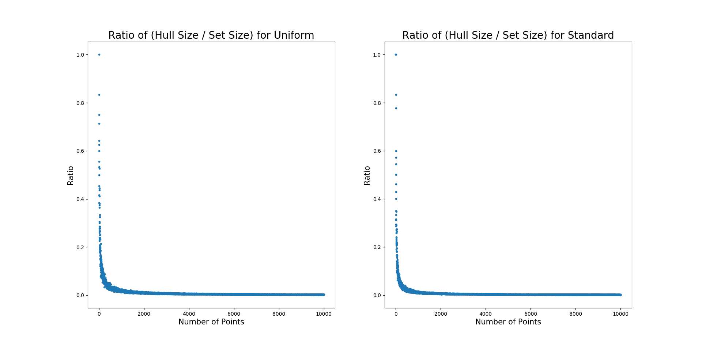
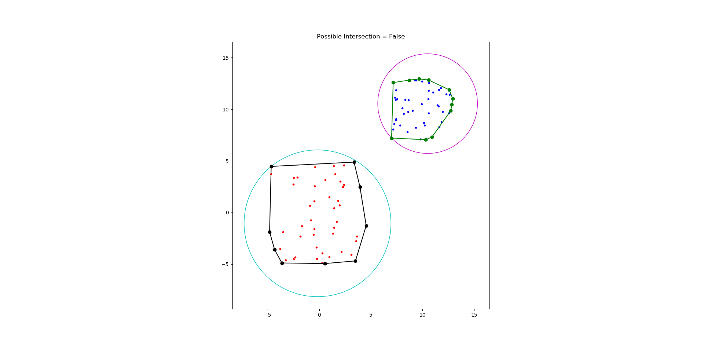
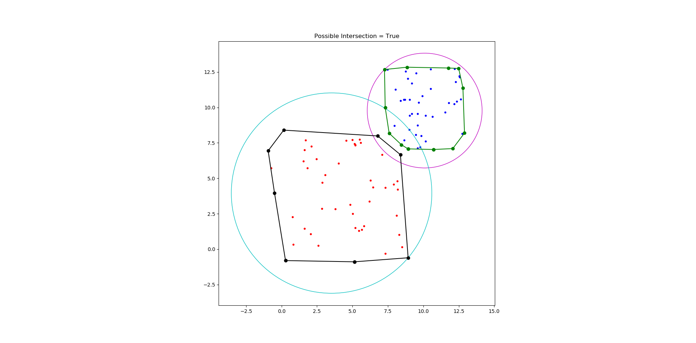

# CMPE 365 Lab 3
## Max Gillham - 10183941 - 14mfg2@queensu.ca

### Question 1 - Ratio Hull Size to Set Size for Uniform Distribution
Using the Graham Scan Algorithm and a set of n points, uniformly distributed about the origin I investigated the computed convex hull and its properties.  
Consider a set of 50 coordinates (x,y) where x and y are ranged from [-5,5] distributed uniformly.  




Now, consider repeating this process for various set sizes and recording the ratio of the size of the hull by the size of the set.
```
for i = 3 up to n:
    size of set = i
    ratio = hull size / set size
plot(x=size of set, y=ratio)
```
Below is a plot of the ratios on the y axis and set sizes on the x axis, where the inputted set sizes go from 3 to 100.


For set sizes sampled form 3 to 100, the average ratio is ~0.27.  Now, increasing the set size from 3 to 1000.

  

For set sizes 3 to 1000, the average ratio computed over this interval is ~0.06.

### Question 2 - Ratio Hull Size to Set Size for Normal Distribution  
Similar to the previous question, we repeat the experiment of hull ratios, however, this time the x and y coordinates are generated by a normal distribution centered about the origin.  
First consider a set of 50 coordinates (x,y) where x and y are ranged from ~(-5,5) distributed normally.


Now we iterate, similar to before, for the sample set size from 3 to 100.  


Where the average ratio over this interval is ~0.22.  Repeat, but this time for set sizes 3 to 1000.


Where the average ratio over this larger interval is computed as ~0.04.  

The average ratio for the points deviate more when the number of samples is smaller. For small sample size n, the ratio generated from uniform points is larger. However, as the size of the sample set gets larger the ratios both approach 0.  The standard normal distribution appears to converge to 0 at a faster rate.







### Question 3 - Do the Hulls NOT Intersect
Checking if the hulls intersect is challenging, however one can determine if two do not intersect by checking if their respective circles about the convex hull intersect.  Given two sets of points, I compute the convex hulls, smallest circle such that it contains the points and determine if the hulls have a possibility of intersecting.
For example, given a set of 50 points centered at (10,0) with Uniform(-3,3) distribution, and a set of 50 points centered at (0,0) with Uniform(-5,5) distribution, this method renders the following correct output.



Here, this method can determine that the two convex hulls do not intersect.   However, it can only detect if there is a possibility of intersection.  As you can see, this method returns true for the following sets of points, however only one of the examples actually has overlapping convex hulls.


  



### Question 4 - Do the Hulls also intersect
Now that we can determine if the hulls don't intersect, we can investigate if the hulls intersect given that their boundering circles intersect. One way to do this is to compute where each hull boundry lies.  So given that two hulls may intersect, we can figure out the region where the possible intersection may be by computing the overlapping area of the circles.   From here, we can sort the points of the hulls by polar angle, with respect to the point with the lowest y coordinate between the two hulls.  At this point we can compute the range of x and y coordinates in this region for each hull and deduce if they actually overlap.
