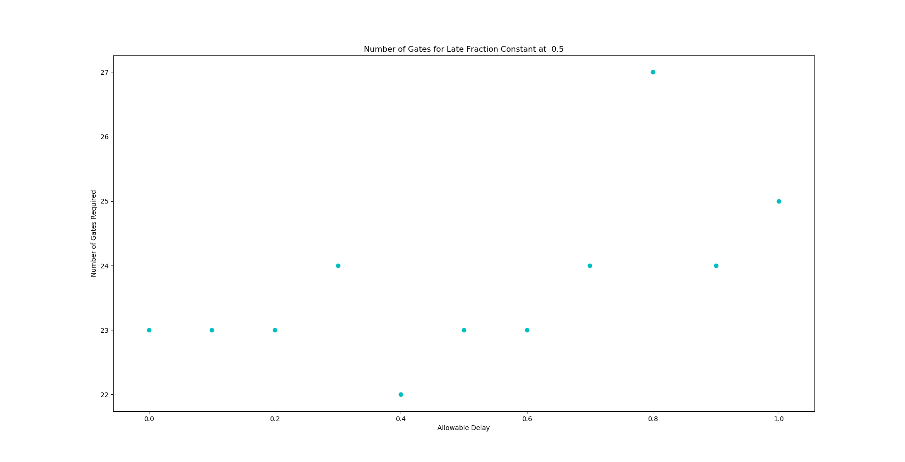
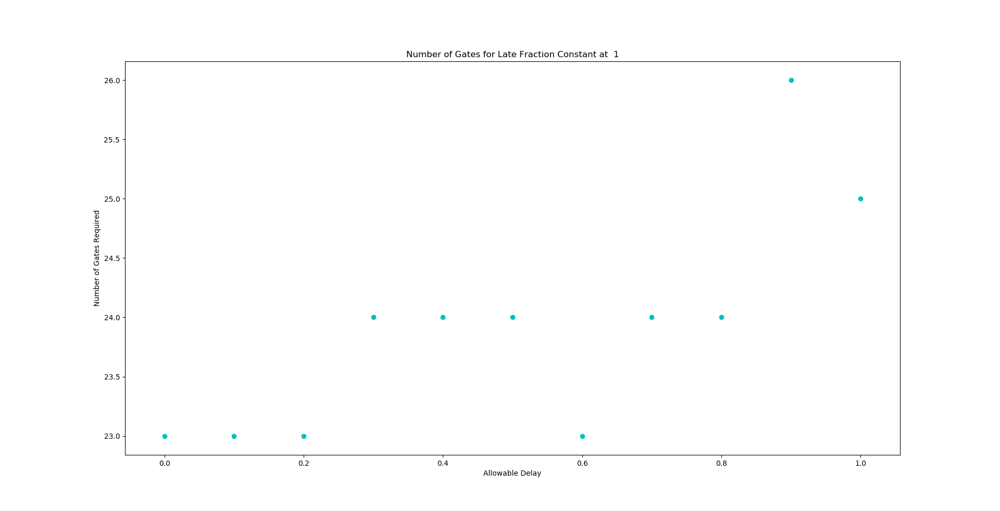
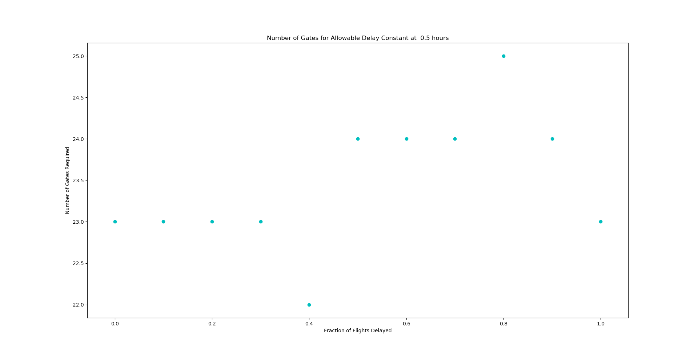
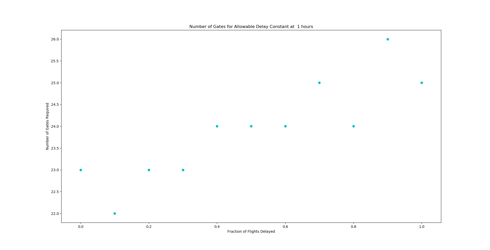
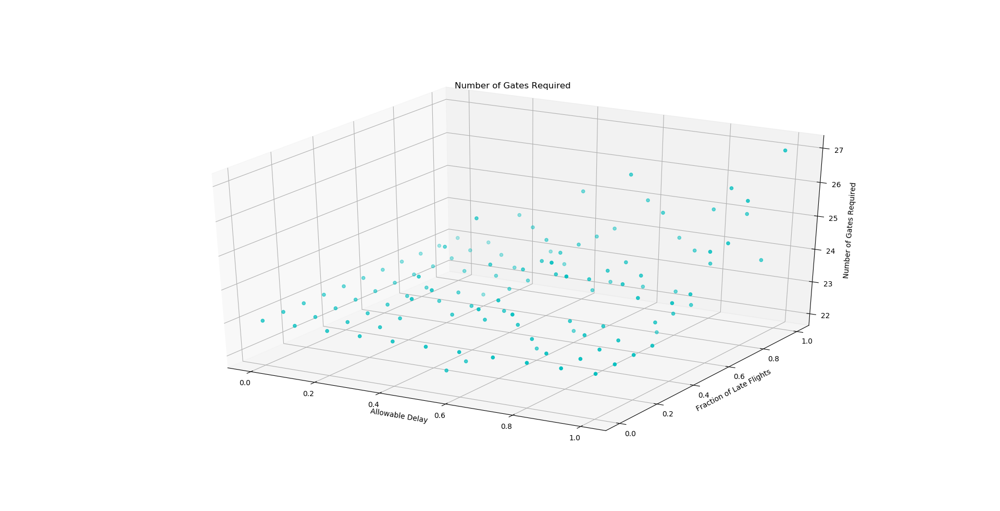

# CMPE 365 Lab 4
## Max Gillham - 10183941 - 14mfg2@queensu.ca

### Question 1 - Number of Gates
Given two test files, we compute the smallest number of gates required so that all the planes can arrive and depart on scheduled time.  Assuming no plane is late, I processed the csv files into two lists of 2-tuples.  Each list corresponds to either `start1.csv` and `finish1.csv` or  `start2.csv` and `finish2.csv`. For example, consider `start1.csv` and `finish1.csv`, they are now in a list:  
`(start(i),finish(i)) where i is an element of {0,1,2,...len(start1.csv)}`  
To determine the number of gates required, I start by finding the elements of the list that overlap.  This is the structure of the greedy algoirithm to find overlapping times.
```
get_overlapping_times(times):
    times = sort planes by arrival
    create empty list A
    index = 0

    for i from 1 to # of entries in csv file
        if plane i arrives after plane k leaves
            index = i
        else
            A = A + plane i appended
    return A
```
This returns a list of all times that overlap with another time, atleast once.  To check the amount of gates required, we need to determine what overlapping times are grouped together.

```
get_number of gates(times):
    number_of_gates = 1
    overlapping_times = get_overlapping_times(times)
    while overlapping_times contains atleast 1 value:
        number_of_gates ++
        overlapping_times = get_overlapping_times(overlapping_times)
    return number_of_gates
```

Performing such algorithms with the scheduling data provoided on Onq,I yeilded the following results.  
```
Set 1: 23 gates required
Set 2: 25 gates required
```

### Question 2 - Expecting Delays
The previous algorithm can be used to evaluate how the number of gates required changes with respect to delays.  To model arrival and departure delays I assumed the following:
* The amount of time between arrival and departure cannot decrease when a delay occurs
* If the arrival is delayed by `x`, then the departure must be delayed by atleast `x`
* A delay in a flight results in a delay on arrival and in turn, a delay in departure
* The fraction of flights delayed can be modelled by a uniform random variable between 0 and 1

To model potential delays in a series of flights and the effect on their arrival and departure times, I used the following idea.
```
fraction_of_flights_delayed = random value between 0 and 1
max_delay = maximum allowable delay
flight_delays = True/False list of length(# of flights), where fraction_of_flights_delayed corresponds to number of Trues 
for i=0 to # of flights
    if flight_delays(i) == True
        Flight i is delayed
        arrival delay = random number from (0 to max_delay)
        departure delay = random number from (arrival delay to max_delay)
```
Doing so, for any flight, the arrival time is always before the departure time and the amount of time between arrival and departure is either constant or increased when a delay occurs.  
Using the provided scheduling data, randomly selecting a fraction of flights to be delayed for each set of data, delaying those flights for each set accordingly, and then computing the number of gates required as per question 1, I yielded the following results.

```
Set 1:  24 gates required for 78 delays of up to 15.0 Minutes
Set 1:  24 gates required for 48 delays of up to 30.0 Minutes
Set 1:  25 gates required for 122 delays of up to 45.0 Minutes
Set 1:  24 gates required for 93 delays of up to 60 Minutes

Set 2:  24 gates required for 127 delays of up to 15.0 Minutes
Set 2:  25 gates required for 52 delays of up to 30.0 Minutes
Set 2:  26 gates required for 117 delays of up to 45.0 Minutes
Set 2:  26 gates required for 66 delays of up to 60 Minutes
```

The number of gates required flucutates as the fraction of flights delayed and maximum delay allowance change.  To observe the affect of these paramenters, first consider keeping the fraction of flights constant, and incrementing the allowable delay from 0 to 1 hour.  





As the late fraction is kept constant, the effect of increasing delay magnitude generally increases the number of gates required, however it can also decrease as the flights selected for delay are randomly chosen. Consider if we have three flights arriving and departing all near time 0, and a fourth flight ariving and departing 1 hour after flights 1,2 and 3, then delaying the fourth flight will not affect the number of gates, but delaying flights 1 2 or 3 may increase the number of gates.  This causes the stochasticity in the relationship of number of gates.  When all gates are delayed the number of gates required increases more linearly with allowable delay.  
Now consider keeping the allowable delay constant, and incrementing the fraction of total flights delayed from 0 to 1.





When the maximum allowable delay is kept consant at 0.5, the number of gates fluctuates when the late fraction is incremented.   This is because as the window of delay is 30 minutes, if a flight selected to be delayed, it can be delayed by at most 30 minutes, and depending on how the arrival and departures are spread out this may or may not increase or decrease the amount of gates required. Consider flights being delayed by atmost 1 hour, this causes more chance of a delayed flight overlapping other flights, making the number of gates increase with flight flaction.  
Now, consider incrementing the maximum allowable delay from 0 to 1 hour, by 0.1 hour steps, and incrementing the fraction of flights delayed from %0 to %100 by %10 increments. 



By the above plot, it is shown that in general, the number of gates required increases linearly as a function of increasing allowable delay and increasing fraction of late flights.
