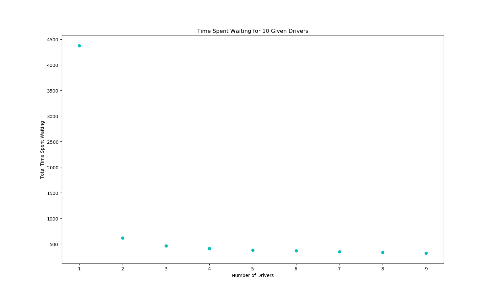
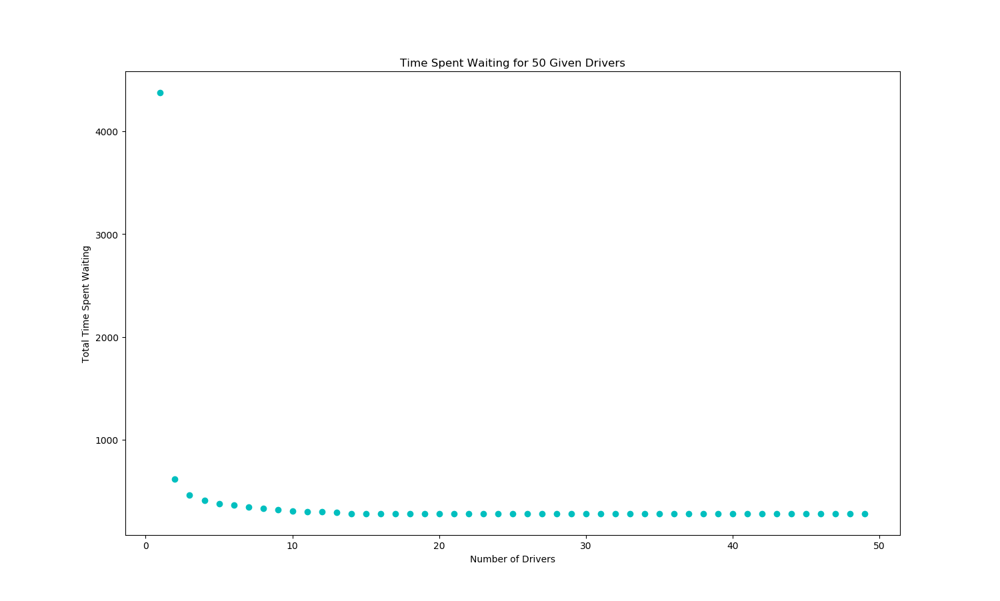
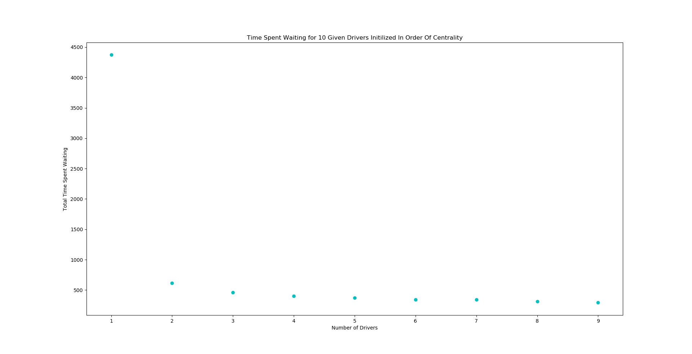
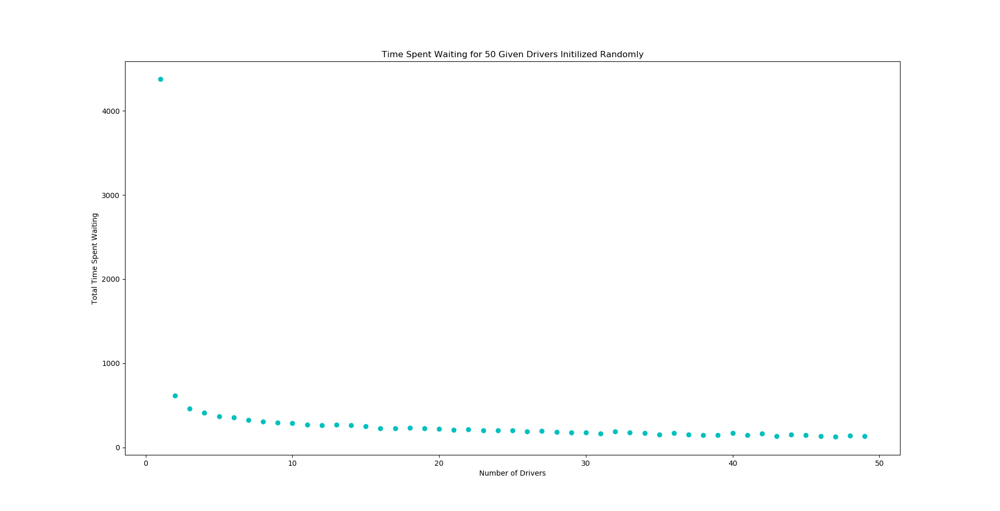
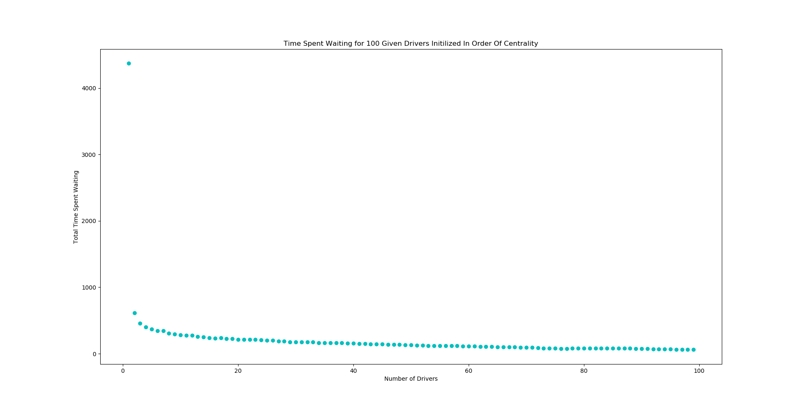

# CMPE 365 Final Assignment
Max Gillham - 10183941
## Topic - Uber 
Given two csv files, one being an adjacency matrix of locations and the other being ride request information, dispatch drivers for requests such that the time requesters spend waiting is minimized.  The city graph data is 50 by 50 matrix, where entry (i,j) is amount of time taken to drive from node i to node j.  These entries are all 0 for distance i -> j where i = j, and >= 0 elsewhere.  The request data is sorted by the time of the request in the first column, the requested pickup location in the second column and the requested drop-off location in the third column. It is assumed a driver cannot look ahead to future request information to anticipate pickup locations.

## Optimizing the Driver Navigation
With the given city graph data, there weights i -> j = 0 when i != j.  Also, there are distances in this graph that are not necessarily the shortest possible path.  In order to optimize the drivers, we must optimize the paths the drivers take from node to node.  Since we do not know where the drivers will be requested, we must compute all shortest paths to each node, starting at each location in the graph. Since we need to find all shortest paths for each starting node, this brings rise to the Floyd Warshall algorithm. The result of the algorithm is a directed graph, however each distance in the graph is distance of the shortest possible path.  Below is the pseudo code for this algorithm.  
This first part of the algorithm just changes the weights of the graph data to infinity if the distance from node to node is zero and the nodes are not the same location.  

```
for each i from 1 to 50
    for each j from 1 to 50
        if i != j and graph[i, j] == 0
            graph[i, j] = infinity
return graph
```  

Once the graph data is manipulated, the following triple nested for loop finds the weight of the shortest possible path.  

```
for i from 1 to 50
    for j from 1 to 50
        for k from 1 to 50
            if graph[j,k] > graph[j,i] + graph[i,k]
                graph[j,k] = graph[j,i] + graph[i,k]
return graph
```
This results in a graph with weights of shortest possible paths for each entry.  This algorithm has a complexity of O(n^3).

## Dispatching Drivers

In order to dispatch drivers, I created a driver class with 4 methods of functionality.  The drivers can pickup a requester, drive the requester to their drop-off location, get an estimated time of arrival to to a given location and wait for the next request to come in.

```
pickup(pickup_location, request_time)
    update driver time to drive from current location to pickup location
    update location to pickup location
    if they arrived after the pickup location
        add the wait time to counter
    else (driver was early or on time)
        set driver time to pickup time

dropoff(dropoff_location)
    update driver time with time to dropoff from pickup location to dropoff location
    set driver location to dropoff location

get_eta(location)
    return current time + time to arrive at given location

update_time(time)
    if driver time is < time
        set driver time to given time
    else
        return
```
These methods of a driver class provide the functionality to appropriately dispatch drivers for requests.  
First consider all drivers starting at location node 1, and then we will consider having drivers start the day with various distributions of the map.
### All Drivers Starting At Same Location
Below is the outline of distributing drivers to any given request in the request data file. Here, drivers always begin at location node 1. 

```
def wait_times(network, requests)

    driver_1 = instance of Driver class
    driver_2 = instance of Driver class

    for each request in request data
        if driver_1 time < request time
            update driver_1 time to request time
        if driver_2 time < request time
            update driver_2 time to request time

        if driver_1 has earlier ETA than driver_2
            driver_1 picks up requestor
            driver_1 drops off requests
        
        else
            driver_2 picks up requestor 
            driver_2 drops off requestor
    
    return (driver_1 late count + driver_2 late count)
```

Running this method with the original data yields a total waiting time of 4376 for just one driver and 618 for two drivers taking requests throughout the day.  Expanding this algorithm to input n drivers is as follows.

```
def wait_times_n_drivers(n, network, requests)

    total late count to 0
    create a list of n instances of driver class, all starting at location 0

    for i from first to last request
        
        for each driver in driver list
            if driver[i] time < request time
                update driver[i] time to time of request
            get eta to pickup location for driver[i]

        chosen driver = driver with earliest eta

        chosen driver picks up requestor
        chosen driver drops off requestor
    
    total late count += late count for drivers 1 to n
    return total late count
```

This adjustment allows us to manipulate the number of drivers available to take requests. For the original data given, below is a plot of total time requesters spent waiting with respect to the number of drivers taking requests over the day.



As you can see, there is a large decrease in time spent waiting for having 1 driver taking requests to 2 requests.  The amount of time then starts to approach a limit.  See below the plot for up to 50 drivers.



The total amount of time spent waiting approaches a limit of 279. This hits a limit as the drivers are all beginning at node 0, however, if we change the initial distribution of drivers to span the locations, we can avoid some of these cases where drivers are late.

### Drivers Beginning at Different Locations
Consider instead of initializing all drivers to location 0, we uniformly distributed them along all locations.  This has little to no effect on the wait times when only one driver is used, however, when the number of drivers increases, the time spent waiting will not hit a minimum, but will converge to zero.  
First consider wait times for 1 to 10 drivers, where each driver is initialized uniformly across locations.



There isn't a very large noticeable difference until we consider more drivers.



When there is more drivers available, the probability of a requester having a zero wait time increases, as there is a greater chance that a driver is initialized at the requesters pickup location and simply waits until that request comes in. See below for up to 100 drivers.




The most significant difference here is when the number of drivers increase, the total time requesters spend waiting decreases, and do not hit a limit.  
Using this method to initialize drivers, we yield a total wait time of 70 for 100 drivers, as opposed to the previous wait time of 279 when all drivers were initialized to the same location.