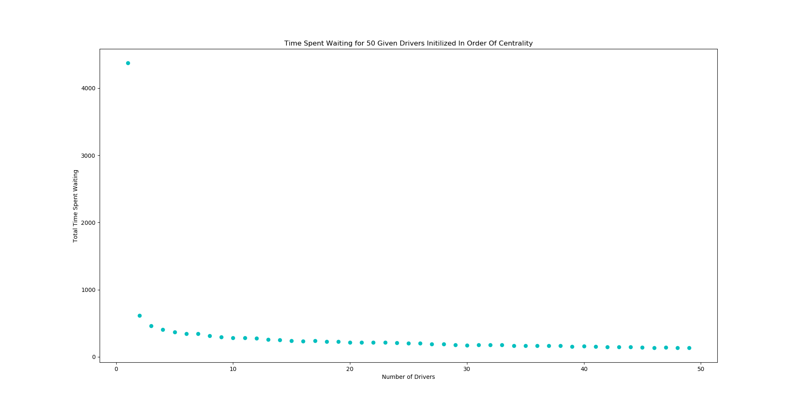

# CMPE 365 Final Assignment
Max Gillham - 10183941
## Topic - Uber 
Given two csv files describing the requests for a city and a adjancency matrix describing distance between locations, creat an optimal dispatching of drivers such that the time requestors spend waiting is minimized.  The city graph data is 50 by 50, where entry (i,j) is amount of time taken to drive from node i to node j.  These entries are all 0 for distance i -> j where i = j, and >= 0 elsewhere.  The request data is sorted by the time of the request in the first column, the requested pickup location in the seccond column and the requested dropoff locaiton in the third column.

## Optimizing the Driver Navagation
With the given city graph data, there weights i -> j = 0 when i != j.  Also, there are distances in this graph that are not necesarily the shortest possible path.  In order to optimize the drivers, we must optimize the paths the drivers take from node to node, for all possible nodes in the graph.  To do this I implemented the Floyd Warshall algorithm as the shortest path has to be calculated for each node, to every other possible node.  The result is a adjacency matrix, however each edge weight is now the weight of the shortest possible path.  Below is the pseudo code for this algorithm.

```
for each i from 1 to 50
    for each j from 1 to 50
        if i != j and graph[i, j] == 0
            graph[i, j] = infinity
return graph
```

This first part of the algorithm just changes the weights of the graph data to infinity if the distance from node to node is zero and the nodes are not the same location.  Once the graph data is manipulated, the following tripple nested for loop finds the optimal path.

```
for i from 1 to 50
    for j from 1 to 50
        for k from 1 to 50
            if graph[j,k] > graph[j,i] + graph[i,k]
                graph[j,k] = graph[j,i] + graph[i,k]
return graph
```
This loop will find the shortest paths from each node to every other node.  This algorithm has a time complexity of O(n^3).

## Dispatching Drivers

In order to dispatch drivers, I created a driver class with 4 methods of functionality

```
pickup(pickup_location, request_time)
    update driver time to drive from current location to pickup location
    update location to pickup location
    if they arrived after the pickup location
        add the wait time to counter
    else (driver was early or on time)
        set driver time to pickup time

dropoff(dropoff_location)
    update driver time with time to dropoff from pickup location to dropoff location
    set driver location to dropoff location

get_eta(location)
    return current time + time to arrive at given location

update_time(time)
    if driver time is < time
        set driver time to given time
    else
        return
```
These methods of a driver class provide the functionality to appropriotly dispatch drivers for requests. First consider all drivers starting at location node 1, and then we will consider having drivers start the day with various distributions of the map.
### All Drivers Starting At Same Location
Below is the outline of distributing drivers to any given request in the request data file. Here, drivers always begin at location node 1. 

```
def wait_times(network, requests)

    driver_1 = instance of Driver class
    driver_2 = instance of Driver class

    for i from first to last request

        request_time = requests[i,0]
        pickup_location = requests[i,1]
        dropoff_location = requests[i,2]

        update driver 1 time to request_time if driver time < request_time
        update driver 2 time to request_time if driver time < request_time

        if driver_1 has earlier ETA than driver 2
            driver 1 picks up requestor
            driver 1 drops off requests
        
        else
            driver 2 picks up requestor 
            driver 2 drops off requestor
    
    return driver_1.late_count + driver_2.late_count
```

Runnning this method with the origonal data yeilds a total waiting time of 4376 for just one driver and 618 for two drivers requests throughout the day.  Expanding this algorithm to input n drivers is as follows.

```
def wait_times_n_drivers(n, network, requests):

    total late count to 0
    create a list of n instances of driver class, all starting at location 0

    for i from first to last request
        request_time = requests[i,0]
        pickup_location = requests[i,1]
        dropoff_location = requests[i,2]

        update each driver time to request time

        get eta to pickup_location for each driver in list

        chosen driver = driver with earliest eta

        chosen driver picks up requestor
        chosen driver drops off requestor
    
    total late count += late count for drivers 1 to n
    return total late count
```

This adjustment alows us to enter a number of n as input to counting wait times. For the origonal data given, below is a plot of total time requestors spent waiting with respect to the number of drivers taking requests over the day.


As you can see, there is a large decrease in time spent waiting for having 1 driver taking requests to 2 requests.  The amount of time then starts to approach a limit.  See below the plot for up to 50 drivers.


Below is for up to 100 drivers.


The total amount of time spent waiting approaches a limit of 279. This hits a limit as the drivers are all begining at node 0, however, if we change the initial distribution of drivers to span the locations we yeild interesting results.

### Drivers Begining at Different Locations
Consider instead of initializing all drivers to location 0, we uniformly distributed them along all locations.  This has little to no effect on the wait times when only one driver is used, however, when the number of drivers increases, the time spent waiting will not hit a minumm, but continue converging.  
First consider wait times for 1 to 10 drivers, where each driver is initalized uniformly across locations.


Next, consider 1 to 50 drivers.



And finally, 1 to 100 drivers.


The most significant difference here is when the number of drivers increase, the total time requestors spend waiting decreases, and do not hit a limit.  
Using this method to initialize drivers, we yeild a total wait time of 